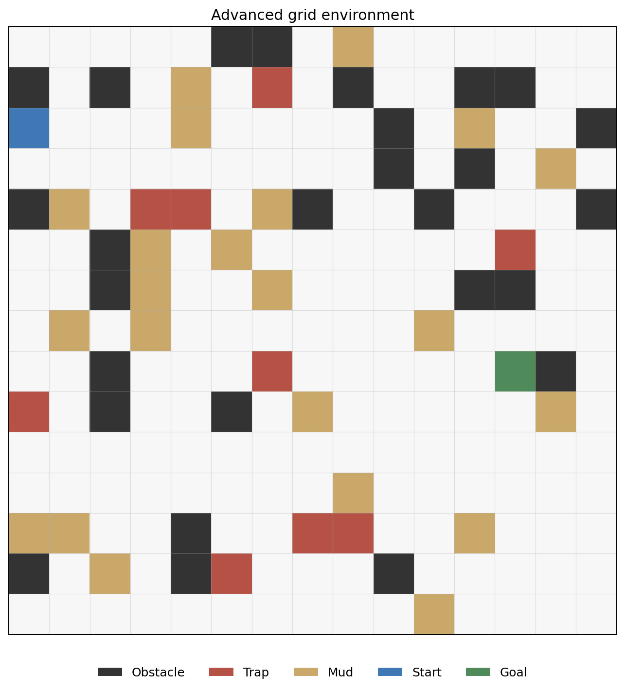
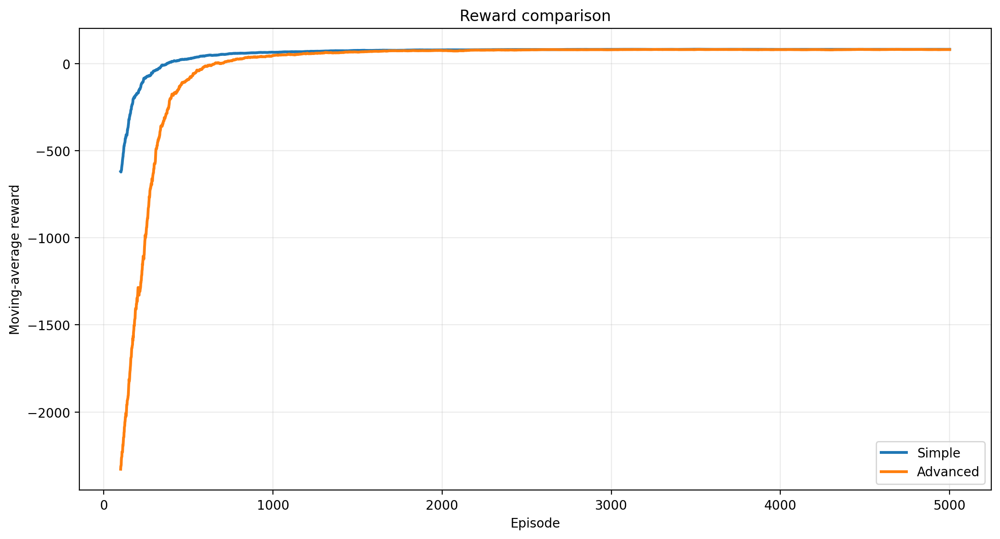
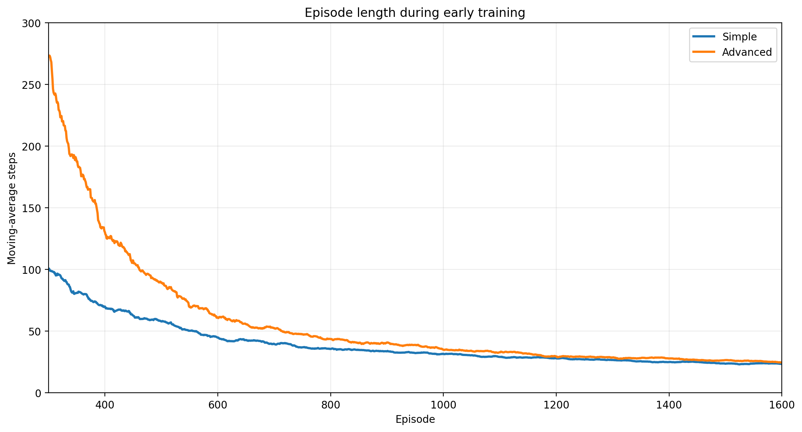
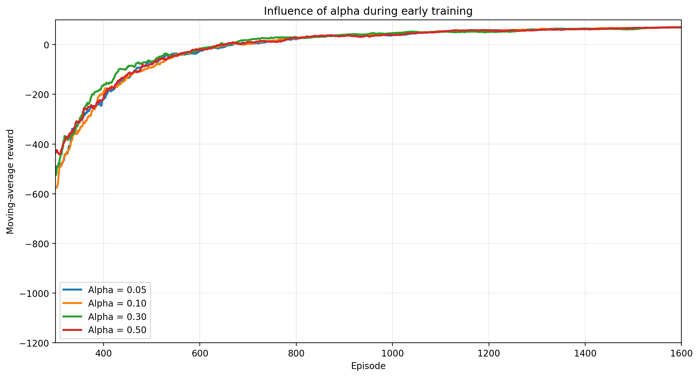
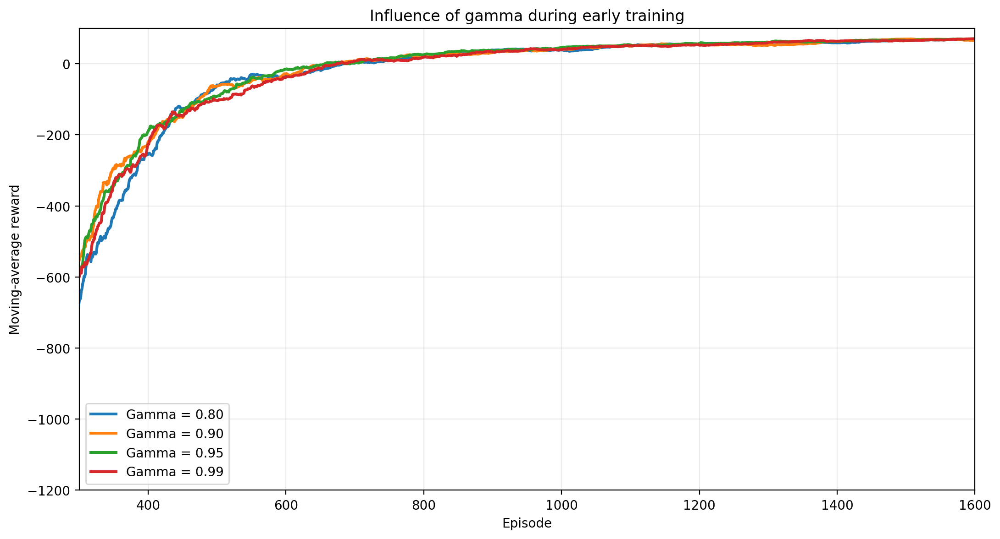

# Reinforcement Learning Exploration Agent

A grid-world reinforcement learning project built from scratch to study how a tabular agent learns when navigation becomes progressively more costly.

The task stays the same throughout the experiments: reach a fixed goal on a 15 × 15 map. The simple environment contains obstacles only, while the advanced version adds mud cells and traps. Both environments use the same seed and base obstacle layout, which makes the comparison easier to interpret.



## Environment

The agent can move up, down, left or right. An episode ends when the goal is reached or after 900 steps.

| Event | Reward |
| --- | ---: |
| Regular move | -1 |
| Mud cell | -4 |
| Collision | -6 |
| Trap | -25 |
| Goal | +100 |

A trap sends the agent back to its starting position. Mud remains traversable, but makes a route more expensive.

The advanced map uses:

```text
obstacle density = 0.12
trap density     = 0.04
mud density      = 0.10
```

## Q-learning

The state is the agent's position in the grid. The Q-table stores one value for each state-action pair.

Actions are selected with an epsilon-greedy policy, with random tie-breaking when several actions share the highest Q-value.

After each transition, the table is updated with:

$$
Q(s,a) \leftarrow Q(s,a) + \alpha \left[r + \gamma \max_{a'}Q(s',a') - Q(s,a)\right]
$$

For terminal transitions, only the immediate reward is used.

The default training configuration is:

```text
episodes = 5000
alpha    = 0.10
gamma    = 0.95
epsilon  = 1.00
seed     = 4
```

Epsilon decreases during training. The curves below use a 100-episode moving average.

## Results

### Simple and advanced environments

The advanced environment is much less forgiving at the beginning of training. Random exploration leads to more collisions, longer episodes and repeated returns to the starting position after traps.



| Metric | Simple | Advanced |
| --- | ---: | ---: |
| Mean reward, first 100 episodes | -620.0 | -2328.7 |
| Mean steps, first 100 episodes | 394.1 | 788.5 |
| Mean reward, last 100 episodes | 81.7 | 80.3 |
| Greedy evaluation reward | 83 | 83 |
| Greedy evaluation steps | 18 | 18 |

Despite the large gap during exploration, both agents eventually learn a policy that reaches the goal in 18 steps, without a collision or trap during evaluation.

On this map, the hazards mainly affect the learning process rather than the final route.



### Learning rate

The learning rate was tested with values 0.05, 0.10, 0.30 and 0.50 while keeping gamma fixed at 0.95.



The four runs follow a similar trajectory. Higher values recover slightly faster during parts of early training, but the curves later overlap and every trained policy reaches the same evaluation result.

Alpha = 0.10 is kept as a neutral baseline rather than presented as an optimal value.

### Discount factor

The discount factor was tested with values 0.80, 0.90, 0.95 and 0.99 while keeping alpha fixed at 0.10.



The differences are again concentrated in the early part of training and no value stays clearly ahead. All four runs produce the same greedy evaluation policy, so gamma = 0.95 remains the default setting.

These experiments use one fixed map and one seed. They describe what happened in this controlled comparison, but they are not enough to rank the hyperparameters in general. A broader study would average results across several seeds and generated layouts.

## Repository structure

```text
agents/        Q-learning agent and action-selection logic
environment/   Base grid world and advanced environment
experiments/   Training, evaluation and comparison scripts
results/       Configurations, metrics, Q-tables and figures
```

## Running the experiments

Install the dependencies from the repository root:

```bash
pip install -r requirements.txt
```

Train the simple and advanced agents:

```bash
python -m experiments.q_learning_training
```

Generate the environment comparison figures:

```bash
python -m experiments.compare_experiments
```

Run the hyperparameter experiments:

```bash
python -m experiments.hyperparameter_experiments
```

Generate the alpha and gamma comparison figures:

```bash
python -m experiments.compare_hyperparameters
```

Each run saves its configuration, episode metrics, final evaluation, grid and Q-table. The comparison plots are generated from the saved results, so training does not need to be repeated to rebuild the figures.

## Next steps

The next stage is to replace the Q-table with a Deep Q-Network.

The DQN agent will receive a local observation around its current position instead of using its exact grid coordinates as a tabular state. It will use a replay buffer, a target network and an epsilon-greedy policy.

The planned progression is:

- implement a DQN baseline;
- add a local observation window;
- compare Q-learning and DQN on the same environments;
- test PPO under the same evaluation protocol.
